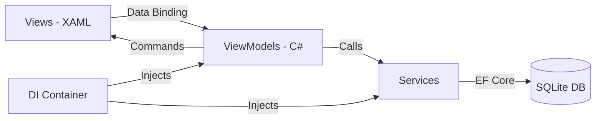

# 👑 Elite POS — Premium Point of Sale System

<div align="center">


**A production-ready, offline-first desktop POS system built for Pakistani retail shops.**  
Designed for **Photostate shops, Print shops, Stationery stores**, and general retail — with **Urdu/English bilingual support**, **Khata (credit ledger)**, **Wholesale pricing**, and **Profit analytics**.

---

[Features](#-features) · [Screenshots](#-screenshots) · [Quick Start](#-quick-start) · [Architecture](#-architecture) · [Tech Stack](#-tech-stack) · [Contributing](#-contributing)

</div>

---

## ✨ Features

### 🏪 Cashier Panel (POS)
- **Fast Product Search** — Search by English name, Urdu name, or barcode
- **Category Filtering** — Chip-based category filter (Photocopy, Printing, Binding, Digital, Stationery, etc.)
- **Smart Cart** — Add/remove items, adjust quantities, real-time total calculation
- **Wholesale Mode** — Toggle switch to instantly apply wholesale pricing for bulk buyers
- **Custom Services** — Add one-off service items (e.g. "Urgent Typing") not in inventory
- **Quick Cash Buttons** — Rs. 100, 500, 1000, 5000 denomination shortcuts for fast billing
- **Bilingual Receipt** — Professional thermal-printer-style receipt with Urdu product names
- **Change Calculator** — Automatic change due calculation

### 📒 Khata System (Customer Credit Ledger)
- **Udhaar Tracking** — Track customer credit/debt balances in real-time
- **Customer Accounts** — Create and manage customer profiles with phone numbers  
- **Payment Collection** — Record partial or full payments against outstanding balances
- **Transaction Ledger** — Full debit/credit history per customer with invoice references
- **Arrears Integration** — Automatic debt calculation during checkout

### 📊 Admin Dashboard
- **Revenue Analytics** — Today's sales, 7-day revenue, 30-day revenue at a glance
- **Profit Tracking** — Real-time profit calculations (Revenue - Cost - Expenses)
- **Low Stock Alerts** — Visual warnings when products fall below 20 units
- **Stock Valuation** — Total inventory value at cost price
- **Top Products** — Top 5 best-selling items by quantity and revenue
- **Expense Management** — Log and categorize shop expenses (Rent, Electricity, Supplies, etc.)

### 👥 Staff Management
- **Role-Based Access** — Admin and Cashier roles with separate interfaces
- **User Onboarding** — Create staff accounts with hashed passwords
- **Secure Authentication** — SHA-256 password hashing, no plaintext storage

### 🇵🇰 Built for Pakistan
- **44 Pre-loaded Products** — Photocopy, Printing, Binding, Lamination, Digital Services, Stationery
- **Urdu Names** — Every product has an Urdu name (اردو نام) for bilingual receipts
- **PKR Currency** — All prices in Pakistani Rupees (Rs)
- **Local Services** — NADRA tokens, Passport forms, Utility bill payments, CV composing
- **Store Branding** — Customizable store name, address, phone, and Urdu tagline on receipts

---

## 📸 Screenshots

> **Login Screen** — Premium glass-morphic design with Crown branding  
> **POS Screen** — Product grid with Urdu names, smart cart, and quick checkout  
> **Admin Dashboard** — Revenue cards, profit analytics, and top products  
> **Khata Ledger** — Customer credit tracking with full transaction history

*Run the app to experience the full Elite interface!*

---

## 🚀 Quick Start

### Prerequisites
- [.NET 8 SDK](https://dotnet.microsoft.com/download/dotnet/8.0) (Windows)
- Windows 10/11

### Installation

```bash
# Clone the repository
git clone https://github.com/ahmed9088/Shop-POS-software-using-c-.git
cd Shop-POS-software-using-c-

# Restore packages and run
dotnet restore
dotnet run
```

### Default Login Credentials

| Role | Username | Password |
|------|----------|----------|
| 👑 Admin | `admin` | `admin` |
| 🧾 Cashier | `cashier` | `cashier` |

> **Note:** The SQLite database (`pos.db`) is automatically created on first run with seed data including 44 products, 3 sample expenses, and default user accounts.

---

## 🏗️ Architecture

```
PosApp/
├── 📁 Models/                    # Entity models (EF Core)
│   ├── Product.cs               # Products with bilingual names & wholesale pricing
│   ├── Sale.cs                  # Sales with customer & arrears tracking
│   ├── SaleItem.cs              # Line items with profit calculation
│   ├── Customer.cs              # Khata accounts with arrears balance
│   ├── ArrearsPayment.cs        # Payment history for credit customers
│   ├── Store.cs                 # Multi-store support
│   ├── User.cs                  # Staff with role-based access
│   └── Expense.cs               # Shop expense tracking
│
├── 📁 ViewModels/                # MVVM ViewModels (CommunityToolkit.Mvvm)
│   ├── MainViewModel.cs         # Navigation controller
│   ├── LoginViewModel.cs        # Authentication logic
│   ├── PosViewModel.cs          # POS operations, cart, checkout, receipts
│   ├── AdminViewModel.cs        # Dashboard analytics, CRUD operations
│   └── ViewModelBase.cs         # Base class for all ViewModels
│
├── 📁 Views/                     # WPF UserControls (XAML)
│   ├── LoginView.xaml           # Premium login screen
│   ├── PosView.xaml             # Full cashier interface
│   └── AdminView.xaml           # Admin dashboard & management
│
├── 📁 Services/                  # Business logic layer
│   ├── DatabaseService.cs       # EF Core data access (IDatabaseService)
│   ├── AuthenticationService.cs # Login, logout, password hashing
│   └── NavigationService.cs     # View navigation with DI
│
├── 📁 Data/                      # Database context
│   └── AppDbContext.cs          # EF Core context + seed data (44 products)
│
├── 📁 Converters/                # WPF value converters
│   ├── LowStockConverter.cs     # Stock level → visibility/color
│   ├── EqualityConverter.cs     # Generic equality converter
│   └── EqualityMultiConverter.cs # Multi-value equality converter
│
├── App.xaml                     # Material Design theme configuration
├── App.xaml.cs                  # DI container & startup
├── MainWindow.xaml              # Shell window with ContentControl
└── PosApp.csproj                # Project file & NuGet packages
```

### Design Pattern: **MVVM (Model-View-ViewModel)**



### Key Design Decisions
- **Offline-First** — SQLite database, no internet required
- **Dependency Injection** — `Microsoft.Extensions.DependencyInjection` for clean architecture
- **Source Generators** — `CommunityToolkit.Mvvm` for boilerplate-free ViewModels
- **Material Design** — `MaterialDesignInXAML` v4.9.0 for premium UI components

---

## 🛠️ Tech Stack

| Technology | Version | Purpose |
|-----------|---------|---------|
| **.NET** | 8.0 | Runtime & SDK |
| **C#** | 12 | Primary language |
| **WPF** | .NET 8 | Desktop UI framework |
| **SQLite** | 3.x | Embedded database |
| **EF Core** | 8.0.3 | ORM & data access |
| **MaterialDesignInXAML** | 4.9.0 | UI component library |
| **CommunityToolkit.Mvvm** | 8.2.2 | MVVM framework |
| **Microsoft.Extensions.DI** | 8.0.0 | Dependency injection |

---

## 📦 NuGet Packages

```xml
<PackageReference Include="CommunityToolkit.Mvvm" Version="8.2.2" />
<PackageReference Include="MaterialDesignThemes" Version="4.9.0" />
<PackageReference Include="MaterialDesignColors" Version="2.1.4" />
<PackageReference Include="Microsoft.EntityFrameworkCore.Sqlite" Version="8.0.3" />
<PackageReference Include="Microsoft.Extensions.DependencyInjection" Version="8.0.0" />
```

---

## 🤝 Contributing

Contributions are welcome! Here's how:

1. **Fork** the repository
2. **Create** a feature branch (`git checkout -b feature/amazing-feature`)
3. **Commit** your changes (`git commit -m 'Add amazing feature'`)
4. **Push** to the branch (`git push origin feature/amazing-feature`)
5. **Open** a Pull Request

### Ideas for Contribution
- [ ] Barcode scanner hardware integration
- [ ] Thermal printer support (ESC/POS)
- [ ] Daily/Weekly/Monthly PDF reports
- [ ] Multi-store dashboard
- [ ] Dark mode toggle
- [ ] SMS notifications for low stock
- [ ] Cloud backup (optional)

---

## 📄 License

This project is licensed under the MIT License — see the [LICENSE](LICENSE) file for details.

---

## 👨‍💻 Author

**Ahmed Saffar**  
Built with ❤️ in Lahore, Pakistan

[](https://github.com/ahmed9088)

---

<div align="center">

**⭐ Star this repo if you found it useful!**

</div>
